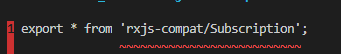
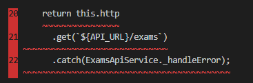

# Frontend-node-angular

Desenvolvimento de uma aplicação com três partes: 1. [Backend](https://github.com/TiagoGIM/Backend-Flask-Docker) usando o microframework FLASK (Python); 2. [Front-end](https://github.com/TiagoGIM/Frontend-node-angular/) será feito com o Angular cli (node.js) e os [dados persistentes](##-Banco-de-dados) ficarão em um servidor que rodará em um container (docker).
O objetivo é transformar todas as partes em containers.

## 1. Jornada de aprendizado
Como eu sempre reclamo que os tutoriais pulam as partes que tem bug, decidi relatar neste arquivo [detalhes e bugs](./app/detalhes_e_bugs.md) cada erro e como eu contornei(ou tentei).
Coloquei em [Temas abordados](##-4.-Temas-abordados.) alguns links que consultei durante a realização do tutorial, a final o objetivo é entender como as coisas funcionam.
### 1.1 Parte 1 
#### 1.1.2 **BUGS**
**Bug 1** -
O primeiro problema que apareceu era um modulo que não estava instalado.
<div  align="center">
<section data-markdown>                    

</section>
</div>
 
Solução: *Instale o modulo rxjs:*

 ``` $ npm i rxjs ```


**Bug 2** - Uma incompatibilidade de Objeto, resolvi com uma dica de uma [StackoverFlow](https://stackoverflow.com/questions/54475893/typescript-type-x-is-missing-the-following-properties-from-type-y-length-pop).


<div  align="center">
<section data-markdown>                    

</section>
</div>

## 2. Ambiente de desenvolvimento
O desenvolvimento foi feito no Windows 10 com subsistema linux (WSL).
Usando angular cli, o cliente é desenvolvido em cima de componentes.

Para iniciar tudo:

```$ npm install -g @angular/cli```

Quando desenvolver sua aplicação basta entrar com `$ ng serve` no terminal para inicia-la. Acesse `http://localhost:4200/`. A app irá reinicar automaticamente sempre que algum mudança for feita.

## 3. Requisitos
- [Docker](https://www.docker.com/)
- [Angular CLI](https://github.com/angular/angular-cli) version 10.1.6.
- [Node.js](https://nodejs.org/pt-br/)

## 4. Temas abordados
- NodeJs no WSL 2[ instalação ](https://docs.microsoft.com/pt-br/windows/nodejs/setup-on-wsl2)
- Um pouco sobre Cross-Origin Resource Sharing [(CORS)](https://developer.mozilla.org/en-US/docs/Web/HTTP/CORS)

